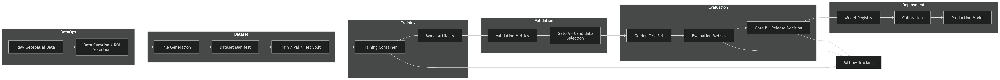
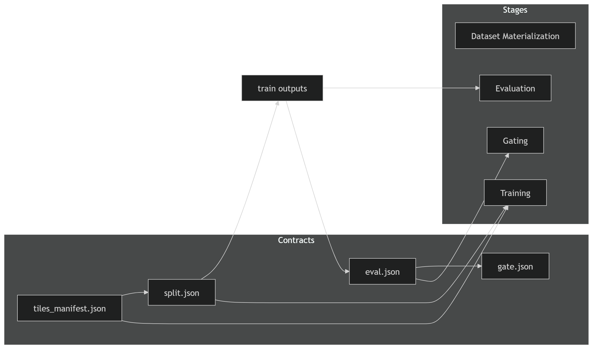
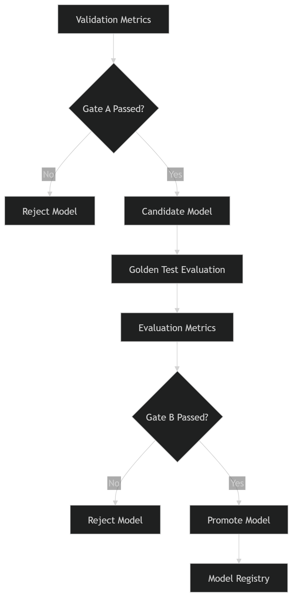

# Geospatial MLOps Pipeline

> Production-grade, task-agnostic MLOps framework for building, evaluating, and deploying machine learning systems on large-scale geospatial data.

---

## 🚀 Overview

This repository implements a **full ML lifecycle pipeline**, designed to take models from raw data to production in a **reproducible, scalable, and automated manner**.
> Designed as a **task-agnostic framework**, this pipeline can be extended to multiple ML problems (segmentation, classification, detection) with minimal changes through modular adapters and contracts.

Unlike traditional ML workflows that loosely couple training and deployment, this system enforces:

- Deterministic data pipelines  
- Strict separation of validation and evaluation  
- Automated, metric-driven release decisions  
- End-to-end reproducibility across experiments  

> This is a **production-grade system-level implementation of MLOps**, not just a training pipeline.

---

## ❗ Problem Statement

Most ML pipelines in practice suffer from:

- ❌ Data leakage between training and evaluation  
- ❌ Inconsistent experiment comparison  
- ❌ Manual and subjective model promotion  
- ❌ Tight coupling between pipeline stages  
- ❌ Poor scalability for distributed training  

As models scale and datasets grow, these issues compound and lead to unreliable systems.

---

## ✅ Solution

This pipeline introduces a **contract-driven, stage-isolated MLOps architecture**:

- 📦 Immutable dataset and evaluation contracts  
- 🔁 Reproducible and containerized training  
- 🧪 Separation of validation (candidate selection) and evaluation (release decision)  
- 🚦 Automated gating for promotion  
- ☁️ Kubernetes-native orchestration 
> Demonstrated improvements include increased model reproducibility, reduced manual intervention, and consistent performance gains across multiple segmentation tasks. 

---

## 🏗️ High-Level Architecture

*Figure: Architecture of the MLOps pipeline*

## ⚙️ Pipeline Stages

### 1. DataOps & Dataset Materialization
- Converts raw data into deterministic datasets  
- Generates tiles and structured metadata  
- Creates **train / validation / test splits**  
- Prevents data leakage  

---

### 2. Training
- Fully containerized execution  
- Consumes immutable dataset contracts  
- Logs metrics, artifacts, and lineage  

---

### 3. Validation (Gate A)
- Evaluates models on validation data  
- Selects best-performing candidate  
- Does **not** determine release  

---

### 4. Evaluation (Golden Test)
- Runs on unseen, held-out dataset  
- Measures real-world performance  
- Produces auditable metrics  

---

### 5. Gate B (Release Decision)
- Converts metrics into pass/fail criteria  
- Prevents regression to production  
- Fully automated decision system  

---

### 6. Promotion & Calibration
- Registers approved models  
- Selects deployment thresholds  
- Finalizes production-ready artifacts  

---

## 🧩 Key Design Principles

### 🔒 Contract-Based Architecture

*Figure: Contracts Diagram*

Each stage produces structured, versioned artifacts:

- `tiles_manifest.json`
- `split.json`
- `eval.json`
- `gate.json`

This ensures:
- reproducibility  
- auditability  
- stage decoupling  

---

### 🔁 Deterministic Pipelines
- Same input → same output  
- Fully reproducible across environments  
- Containerized execution  

---

### 🧪 Separation of Concerns

| Stage | Responsibility |
|------|--------|
| Validation (Gate A) | Candidate selection |
| Evaluation | Performance measurement |
| Gate B | Release approval |

---

### 🚦 Automated Gating

*Figure: Gating Logic*
- Objective, metric-driven decisions  
- Eliminates manual bias  
- Prevents production regressions  
This gating mechanism enforces **objective, reproducible promotion criteria**, eliminating subjective decision-making in model release workflows.
---

## ⚡ System in Action

### 🧩 Argo Workflows (Pipeline Orchestration)


*Figure: End-to-end DAG execution of the MLOps pipeline*

- DAG-based pipeline execution  
- Containerized tasks  
- Scalable orchestration on Kubernetes  

---

### 📈 MLflow Experiment Tracking


*Figure: MLflow Experiment Tracking*


*Figure: MLflow Single Run Metrics*

- Tracks runs, metrics, and artifacts  
- Enables experiment comparison  
- Logs full lineage  

---

### 📦 Model Registry & Versioning


*Figure: Versioned model tracking and promotion lifecycle in MLflow*

- Versioned model artifacts  
- Candidate vs production tracking  
- Full auditability  

---

## 🧪 Example Workflow

A typical experiment lifecycle in this system:

1. Generate dataset tiles from raw geospatial imagery  
2. Create deterministic train/validation splits (`split.json`)  
3. Train segmentation model (e.g., SegFormer)  
4. Log metrics and artifacts to MLflow  
5. Apply Gate A → select best candidate  
6. Evaluate on golden test set  
7. Apply Gate B → enforce release thresholds  
8. Register model in MLflow Model Registry  
9. Promote to production-ready version  

> In practice, this pipeline supports **multi-run experimentation, automated promotion, and full lineage tracking across all stages**.

---

## 📁 Repository Structure

```bash
core/
  contracts/        # Data and evaluation contracts
  tiling/           # Tiling engine and policies
  data/             # Dataset and splitting logic
  train/            # Training engine

tasks/
  segmentation/
    building/
    water/

cli/
  generate_tiles.py
  make_splits.py
  train.py
  evaluate.py
```
---

## ⚡ Scalability
- Distributed training via Ray
- Kubernetes-native execution
- Parallel experimentation
- Handles large-scale geospatial datasets

---

## 🔮 Future Work
- Agent-based pipeline orchestration
- Automated retraining triggers
- Cross-modal generative pipelines
- Expanded support for foundation models


## 🤝 Contributions
This project is designed to be modular and extensible. Contributions are welcome.
