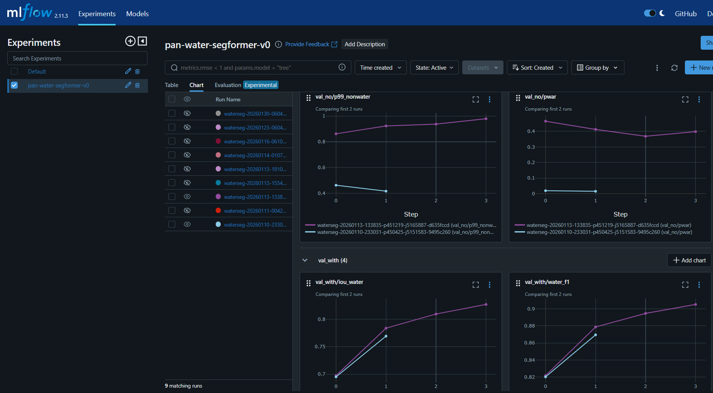
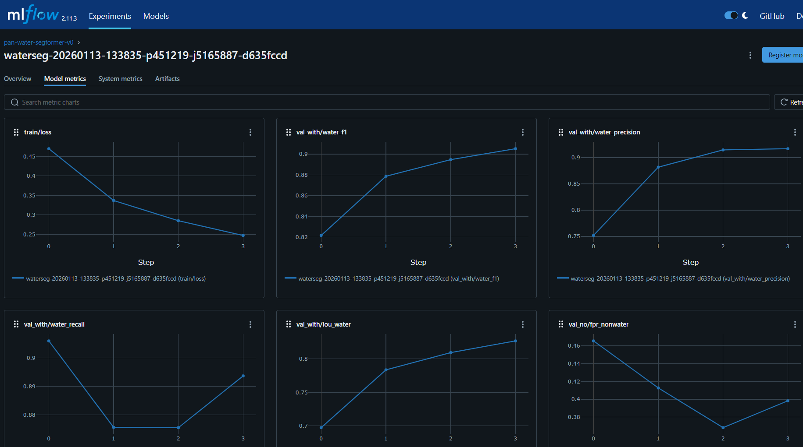
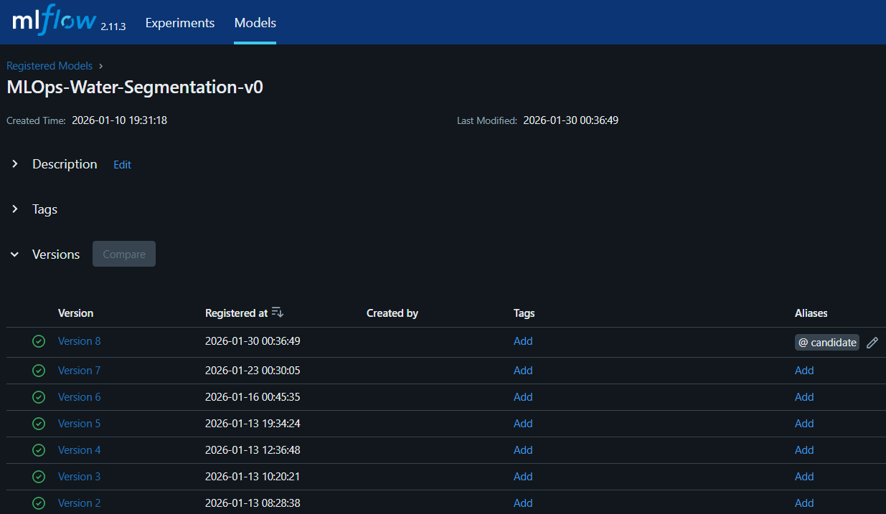
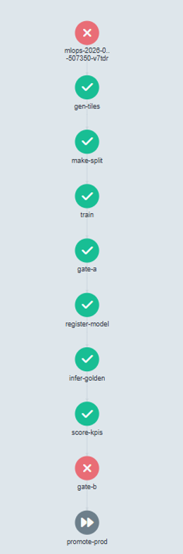
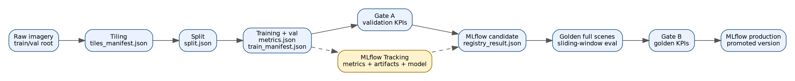
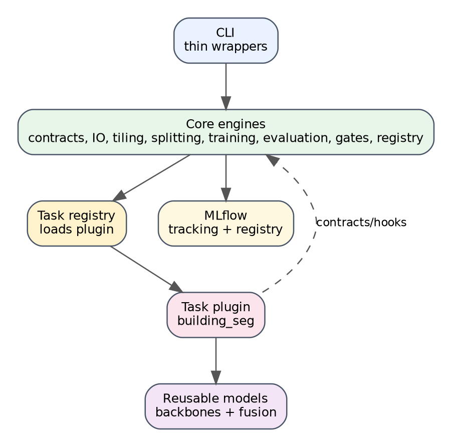
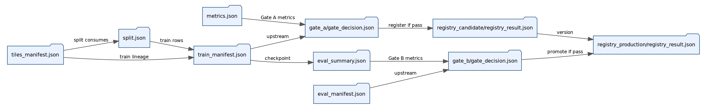
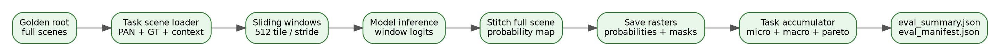
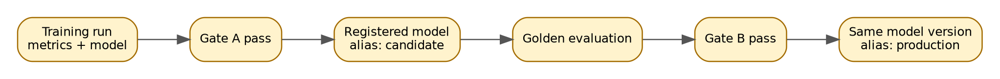

# Geospatial MLOps Pipeline

**A contract-driven MLOps framework for geospatial machine learning: raw imagery → tiling → deterministic splits → training → validation gate → MLflow candidate registration → full-scene golden evaluation → release gate → production promotion.**

This repository demonstrates how a remote-sensing ML workflow can be made reproducible, auditable, extensible, and production-oriented. The current reference task is **building segmentation**, but the pipeline itself is task-agnostic: task plugins define domain-specific data loading, model construction, metrics, and evaluation semantics while the core pipeline owns orchestration, contracts, gates, tracking, and registry transitions.

> Built for geospatial ML, but designed like a general ML platform: task plugins change, lifecycle contracts stay stable.

---

## System in Action

This project is not just a training script. It implements a full ML lifecycle with experiment tracking, model registry transitions, validation gates, golden-set evaluation, and an orchestration-ready structure.

### Experiment Tracking with MLflow

Training logs metrics, parameters, artifacts, checkpoints, and model lineage to MLflow.





MLflow is used to track:

- training and validation metrics
- model checkpoints and MLflow model artifacts
- task configuration and runtime parameters
- lineage between pipeline stages
- candidate and production model versions

---

### Model Registry and Promotion

After validation gates pass, the trained model is registered as a candidate. After golden-set evaluation and release gates pass, the same model version is promoted to production.



This enables:

- versioned model registration
- candidate vs production separation
- auditable promotion decisions
- repeatable model release criteria
- deployment-ready model artifacts

---

### Orchestration-Ready Pipeline

The repo is structured so the same stage boundaries can run locally through CLI commands or be mapped to Kubernetes-native workflow orchestration such as Argo Workflows.



The pipeline enforces strict validation gates: models that fail KPI thresholds are rejected and are not promoted.

---

## Why This Project Exists

Modern ML systems rarely fail only because of model architecture. They fail because of:

- non-reproducible data pipelines
- leakage between training and validation data
- inconsistent golden-set evaluation
- manual and subjective model promotion
- weak lineage between datasets, metrics, checkpoints, and release decisions
- poor separation between research code and production lifecycle logic

This repo addresses those issues with one core rule:

> Every stage emits a contract. Every downstream stage consumes a contract.

That makes the workflow inspectable and production-oriented:

- **Data lineage:** each stage records upstream artifacts and configuration.
- **Reproducibility:** tiling, splitting, training, gates, and evaluation are deterministic where possible.
- **Model governance:** models are promoted only after passing explicit KPI gates.
- **Task extensibility:** new geospatial ML tasks plug into the same lifecycle through a task registry.
- **Operational readiness:** MLflow tracking/registry are integrated, and the design is ready for Argo/Ray scale-out.

---

## End-to-End Pipeline



The current workflow is:

```text
raw geospatial imagery
  -> tile generation
  -> deterministic split
  -> training + validation monitoring
  -> Gate A
  -> MLflow candidate registration
  -> full-scene golden evaluation
  -> Gate B
  -> MLflow production promotion
```

The pipeline can be run through one command:

```bash
python -m geo_mlops.cli.run_pipeline \
  --task building_seg \
  --task-cfg src/geo_mlops/tasks/segmentation/building/config/default.yaml \
  --dataset-root /path/to/train_val_dataset_root \
  --golden-root /path/to/golden_full_scene_dataset_root \
  --run-dir /path/to/output/run \
  --csv-name bldg_tiles_regular.csv \
  --mlflow \
  --mlflow-tracking-uri http://127.0.0.1:5000 \
  --mlflow-experiment building_seg_debug \
  --force-tiling
```

The pipeline writes a complete run directory:

```text
run/
  tiles/
    tiles_manifest.json
    building_seg_tiles_master.csv

  split/
    split.json
    group_stats.csv

  train/
    model.pt
    metrics.json
    train_manifest.json

  gate_a/
    gate_decision.json

  registry_candidate/
    registry_result.json

  golden_eval/
    eval_summary.json
    eval_manifest.json
    predictions/
      probabilities/
      masks/
    tables/
      per_scene_metrics.csv
      building_per_image_metrics.csv
      building_pareto_images.csv

  gate_b/
    gate_decision.json

  registry_production/
    registry_result.json
```

---

## Pipeline Stages

| Stage | CLI | Core package | Main artifact | Purpose |
|---|---|---|---|---|
| Tile generation | `geo_mlops.cli.tile` | `core/tiling` | `tiles_manifest.json` | Discover scenes/ROIs and emit all valid tile records with policy annotations. |
| Split | `geo_mlops.cli.split` | `core/splitting` | `split.json` | Create deterministic group-aware train/validation splits. |
| Training | `geo_mlops.cli.train` | `core/training` | `train_manifest.json`, `metrics.json`, `model.pt` | Train task model, validate during training, log metrics/artifacts to MLflow. |
| Gate A | `geo_mlops.cli.gate` | `core/gating` | `gate_decision.json` | Decide whether validation metrics qualify the model as a candidate. |
| Candidate registry | `geo_mlops.cli.register` | `core/registry` | `registry_result.json` | Register the MLflow model version and assign candidate metadata/alias. |
| Golden evaluation | `geo_mlops.cli.evaluate` | `core/evaluation` | `eval_summary.json`, prediction rasters | Run full-scene sliding-window inference on the golden set. |
| Gate B | `geo_mlops.cli.gate` | `core/gating` | `gate_decision.json` | Decide whether golden-set metrics meet release KPIs. |
| Production promotion | `geo_mlops.cli.register` | `core/registry` | `registry_result.json` | Promote the approved candidate model to production. |

---

## Architecture



The repository is split into four layers:

```text
src/geo_mlops/
  cli/      # thin user-facing command wrappers
  core/     # task-agnostic engines, contracts, IO, gates, registry, orchestration logic
  models/   # reusable neural architecture components
  tasks/    # task plugins that define task-specific semantics
```

The most important boundary is:

- **Core** does not know what a building is, what a foreground label is, or how a task-specific metric should be computed.
- **Tasks** provide adapters for tiling, datasets, model/loss/metrics, full-scene evaluation, and artifact writing.

This enables the same MLOps lifecycle to support segmentation, classification, detection, self-supervised tasks, or future generative workflows.

---

## Contract-Driven Design



Every stage writes a machine-readable contract.

| Contract | Producer | Consumer | Why it matters |
|---|---|---|---|
| `tiles_manifest.json` | tiling | splitting/training | Captures dataset root, task, tiling config, master CSV path, adapter/policy metadata. |
| `split.json` | splitting | training | Captures group-aware train/validation split and split metadata. |
| `train_manifest.json` | training | Gate A / registry / evaluation | Captures checkpoint path, metrics path, upstream data, MLflow run metadata. |
| `gate_decision.json` | gating | registry / pipeline orchestrator | Captures pass/fail decision, thresholds, actual values, and warnings. |
| `eval_summary.json` | golden evaluation | Gate B | Captures full-scene micro/macro metrics and artifact pointers. |
| `registry_result.json` | registry | pipeline orchestrator | Captures model version registered/promoted in MLflow. |

This contract-based architecture gives the pipeline:

- reproducibility
- auditability
- loose coupling between stages
- explicit stage boundaries
- easier local debugging and future distributed orchestration

---

## Golden Evaluation Is Full-Scene Evaluation

Training uses tiles. Golden evaluation does not.



The golden evaluation stage loads full ROI images, runs sliding-window inference, stitches full-scene probability masks, saves full-scene binary masks, and computes metrics at both dataset and image levels.

This is important because golden evaluation should mimic production inference, not validation-time tile sampling.

Golden evaluation produces:

```text
golden_eval/
  eval_summary.json
  eval_manifest.json
  predictions/
    probabilities/
    masks/
  tables/
    per_scene_metrics.csv
    building_per_image_metrics.csv
    building_pareto_images.csv
```

The evaluation summary contains gate-ready metrics:

```json
{
  "metrics": {
    "micro": {
      "precision": 0.74,
      "recall": 0.19,
      "f1": 0.30,
      "iou": 0.18,
      "pixel_accuracy": 0.85
    },
    "macro": {
      "precision": 0.60,
      "recall": 0.16,
      "f1": 0.24,
      "iou": 0.14,
      "pixel_accuracy": 0.85
    }
  }
}
```

---

## MLflow Tracking and Model Governance



The pipeline separates model tracking from model promotion:

1. Training logs the model and metrics to MLflow.
2. Gate A decides whether validation metrics qualify the model as a candidate.
3. The registry step registers the model as a candidate version.
4. Golden evaluation measures full-scene performance.
5. Gate B decides whether the model meets release KPIs.
6. The registry step promotes the approved model to production.

This mirrors production ML workflows where models must pass explicit validation criteria before deployment.

---

## Reference Task: Building Segmentation

The current reference task is `building_seg`.

```text
tasks/segmentation/building/
  config/             # default, all-tiles, hard-mining configs
  data/               # tile dataset and train/val dataset construction
  evaluation/         # full-scene eval scene discovery/loading/writing
  modeling/           # model factory, forward adapter, losses, metrics
  tiling/             # task adapter and tiling component factory
  task.py             # public task plugin facade
```

The building task currently supports:

- PAN/context inputs
- SegFormer-style model construction
- tile-level training with optional policy-based sampling
- validation metrics during training
- full-scene golden evaluation with probability/mask raster outputs
- micro and macro building segmentation metrics
- Pareto/hardest-image analytics tables
- MLflow model logging and registry promotion

---

## Local MLflow Server

For local development:

```bash
mkdir -p /tmp/geo_mlops_mlruns

mlflow server \
  --backend-store-uri sqlite:////tmp/geo_mlops_mlflow.db \
  --default-artifact-root /tmp/geo_mlops_mlruns \
  --host 127.0.0.1 \
  --port 5000
```

Then run the pipeline with:

```bash
--mlflow --mlflow-tracking-uri http://127.0.0.1:5000
```

---

## Repository Structure

```text
src/geo_mlops/
  cli/
    tile.py
    split.py
    train.py
    gate.py
    register.py
    evaluate.py
    run_pipeline.py

  core/
    config/
    contracts/
    dataset/
    evaluation/
    gating/
    io/
    registry/
    splitting/
    tiling/
    training/
    utils/

  models/
    backbones/
    fusion/

  tasks/
    segmentation/
      segmentation_adapter.py
      building/
        config/
        data/
        evaluation/
        modeling/
        tiling/
        task.py
```

---

## What This Project Demonstrates

This repository demonstrates:

- end-to-end ML lifecycle ownership
- geospatial data preparation and full-scene inference
- contract-driven MLOps architecture
- task-agnostic plugin design
- MLflow experiment tracking and model registry
- automated KPI gates for model promotion
- reproducible training/evaluation artifacts
- separation between research code and production lifecycle code
- orchestration-ready stage boundaries for Argo/Ray/Kubernetes

---

## Roadmap

The repo is now ready for higher-leverage extensions:

1. **Distributed golden evaluation with Ray**  
   Full-scene inference is embarrassingly parallel and is the best first scale-out target.

2. **Ray/KubeRay training and sweeps**  
   Add distributed sweeps and training backends while keeping the same contracts.

3. **Argo workflow templates**  
   Map each CLI stage to a Kubernetes-native DAG step.

4. **ROI analysis and data recommendation**  
   Use embeddings and evaluation outputs to identify underrepresented geospatial modes.

5. **Second task plugin**  
   Add water/cloud/change detection to prove the task-agnostic interface.

6. **Self-supervised and generative task families**  
   Extend the same lifecycle to representation learning or image synthesis tasks.

---

## Documentation

- [Pipeline Walkthrough](docs/pipeline_walkthrough.md)
- [Architecture](docs/architecture.md)
- [Contracts](docs/contracts.md)
- [Task Plugins](docs/task_plugins.md)
- [MLflow and Registry](docs/mlflow_registry.md)
- [Roadmap](docs/roadmap.md)

---

## Status

The current implementation supports a complete local lifecycle for the building segmentation reference task:

```text
tile -> split -> train -> gate_a -> register candidate -> evaluate golden -> gate_b -> promote production
```

The next phase is scale-out: Ray for distributed evaluation/training and Argo for workflow orchestration.
